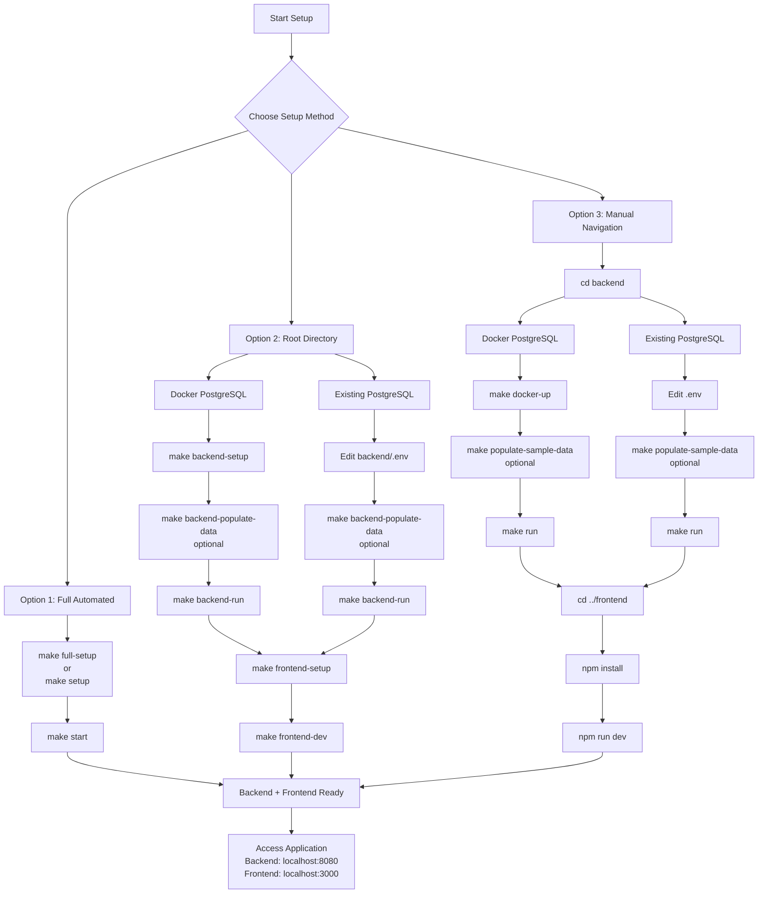

# API Policy Hub

A comprehensive platform for managing and discovering API policies for the WSO2 API Platform. This project provides both a backend API service (built with Go) and a modern frontend application (built with React and TypeScript) for browsing, versioning, and synchronizing API policies.

[](https://golang.org/)
[](https://react.dev/)
[](https://www.typescriptlang.org/)
[](https://www.postgresql.org/)
[](https://opensource.org/licenses/Apache-2.0)

## ✨ Features

### Backend (Go)
- **Policy Management**: Full CRUD operations for API policies
- **Version Control**: Immutable policy versioning with rich documentation
- **Synchronization**: CI/CD integration via sync endpoints
- **Search & Filtering**: Advanced policy discovery capabilities
- **Asset Management**: Support for icons, banners, and media files
- **RESTful API**: Well-documented endpoints with OpenAPI specification
- **Database**: PostgreSQL with SQLC-generated type-safe queries
- **Docker Support**: Containerized deployment with docker-compose

### Frontend (React/TypeScript)
- **Policy Discovery**: Intuitive search and filtering interface
- **Rich Documentation**: Markdown rendering with syntax highlighting
- **Version Management**: Easy browsing of policy versions
- **Theme Support**: Light/dark mode with persistent preferences
- **Fully Responsive**: Optimized for all device sizes
- **Modern UI**: Material-UI components with custom theming

## 🛠️ Tech Stack

### Backend
- **Go** 1.24+ - Backend language
- **Gin** - HTTP web framework
- **PostgreSQL** - Database
- **SQLC** - Type-safe SQL code generation
- **Docker** - Containerization
- **Make** - Build automation

### Frontend
- **React** 19.2+ - UI framework
- **TypeScript** 5.9+ - Type safety
- **Material-UI** 7.3+ - Component library
- **Vite** 7.2+ - Build tool and dev server
- **React Router** - Client-side routing
- **React Markdown** - Markdown rendering

### Monorepo Tools
- **Make** - Unified build automation (root Makefile for cross-project commands)

## 📋 Prerequisites

- **Go**: 1.24.0 or later
- **Node.js**: 18.x or later (tested with v22.14.0)
- **npm**: 9.x or later (tested with v10.9.2)
- **PostgreSQL**: 12 or later
- **Make**: For build automation
- **Git**: For version control
- **Docker**: Optional, for containerized setup

## 🚀 Quick Start

### 1. Clone the Repository
```bash
git clone <repository-url>
cd apim-policy-hub
```


## 🚀 Setup Options

Choose **one** of the following setup methods. Each provides a complete working environment.



### Option 1: Full Automated Setup
```bash
# With sample data (recommended for first-time users)
make full-setup  # Complete setup with Docker, dependencies, SQLC, sample data, and frontend install
make start       # Start both backend and frontend servers

# Without sample data
make setup       # Complete setup with Docker, dependencies, SQLC, and frontend install (no sample data)
make start       # Start both backend and frontend servers
```
*Use `make full-setup` for a fully functional environment with demo data, or `make setup` for an empty database. Backend at `http://localhost:8080`, Frontend at `http://localhost:3000`.*

### Option 2: Backend + Frontend from Root Directory (Recommended)
```bash
# Backend setup (Docker PostgreSQL)
make backend-setup          # Setup PostgreSQL, install deps, generate SQLC
make backend-populate-data  # Populate database with sample policies (optional)
make backend-run            # Start backend server

# Alternative: Backend setup (existing PostgreSQL)
make backend-run            # Start backend server

# Frontend setup (in another terminal)
make frontend-setup  # Install dependencies
make frontend-dev    # Start development server
```
*Use this for separate control of backend and frontend from the project root. Choose Docker or existing PostgreSQL. Recommended for development.*

### Option 3: Manual Directory Navigation
```bash
# Backend setup
cd backend

# For Docker PostgreSQL (default)
make docker-up
make populate-sample-data  # Optional: populate with sample data
make run

# For existing PostgreSQL (skip docker-up, ensure DB exists)
make run

# Frontend setup (in another terminal)
cd ../frontend
npm install
npm run dev
```
*Use this for manual control with directory changes. Choose Docker PostgreSQL or existing PostgreSQL based on your setup. Run backend and frontend in separate terminals.*

## 📁 Project Structure

```
apim-policy-hub/
├── backend/                 # Go backend service
│   ├── api/                # OpenAPI specifications
│   ├── cmd/                # Application entry points
│   ├── internal/           # Private application code
│   │   ├── config/        # Configuration management
│   │   ├── db/            # Database layer
│   │   ├── http/          # HTTP handlers and middleware
│   │   ├── logging/       # Logging utilities
│   │   ├── policy/        # Policy business logic
│   │   ├── sync/          # Synchronization services
│   │   └── validation/    # Input validation
│   ├── scripts/           # Database scripts
│   ├── docs/              # Backend documentation
│   ├── docker-compose.yml # Docker services
│   ├── Dockerfile         # Container definition
│   ├── Makefile           # Build automation
│   └── go.mod             # Go dependencies
├── frontend/               # React frontend application
│   ├── src/
│   │   ├── components/    # UI components
│   │   ├── contexts/      # React contexts
│   │   ├── hooks/         # Custom hooks
│   │   ├── lib/           # Utilities and constants
│   │   ├── pages/         # Route components
│   │   └── content/       # Static content
│   ├── package.json       # Node dependencies
│   ├── vite.config.ts     # Vite configuration
│   └── tsconfig.json      # TypeScript configuration
├── .gitignore             # Git ignore rules
└── README.md              # This file
```

## 📚 Documentation

### Backend Documentation
Located in `backend/docs/`:
- **[Architecture](./backend/docs/ARCHITECTURE.md)** - System design and data flow
- **[Features](./backend/docs/FEATURES.md)** - Complete feature overview
- **[API Reference](./backend/docs/API_REFERENCE.md)** - All endpoints with examples
- **[Setup Guide](./backend/docs/SETUP.md)** - Detailed installation instructions

### API Specification
- **[OpenAPI Spec](./backend/api/openapi.yaml)** - Complete API contract

## 🛠️ Development

### Backend Development
```bash
make backend-test     # Run tests
make backend-build    # Build binary
make backend-lint     # Lint code
make backend-dev      # Run in development mode
make backend-sqlc     # Generate SQLC code
```

### Frontend Development
```bash
make frontend-build   # Production build
make frontend-preview # Preview production build
make frontend-lint    # Run ESLint
```

### Database Management
```bash
make backend-docker-up      # Start PostgreSQL container
make backend-docker-down    # Stop PostgreSQL container
make backend-docker-clean   # Stop containers and remove volumes (clean DB)
make backend-populate-data  # Populate with sample data
```

## 🔧 Configuration

### Backend Environment Variables
Create `backend/.env`:
```bash
SERVER_HOST=0.0.0.0
SERVER_PORT=8080
DB_HOST=localhost
DB_PORT=5432
DB_NAME=policyhub
DB_USER=your_username
DB_PASSWORD=your_password
LOG_LEVEL=info
```

### Frontend Environment Variables
Create `frontend/.env.local`:
```bash
VITE_API_BASE_URL=http://localhost:8080
```

## Support

For support and questions:
- Check the [documentation](./backend/docs/)
- Open an issue on GitHub
- Review the [API Reference](./backend/docs/API_REFERENCE.md)

---

## License

This project is licensed under the Apache License 2.0 - see the [LICENSE](LICENSE) file for details.

